# PPTAGENT: Generating and Evaluating Presentations Beyond Text-to-Slides

Hao Zheng1,2, \* , Xinyan Guan1,2,∗, $\mathbf { H a o K o n g ^ { 3 } }$ , Jia $\mathbf { Z } \mathbf { h e n g } ^ { 1 }$ , Weixiang Zhou1 Hongyu Lin1 ,Yaojie ${ { \bf L } } { \bf u } ^ { 1 }$ , Ben $\mathbf { H e } ^ { 1 , 2 }$ , Xianpei $\mathbf { H a n } ^ { 1 }$ , Le $\mathbf { S u n ^ { 1 } }$

1Chinese Information Processing Laboratory, Institute of Software, Chinese Academy of Sciences 2University of Chinese Academy of Sciences 3Shanghai Jiexin Technology   
{zhenghao2022,guanxinyan2022,zhengjia, weixiang,hongyu,luyaojie}@iscas.ac.cn {xianpei,sunle}@iscas.ac.cn haokong@knowuheart.com benhe@ucas.edu.cn

# Abstract

Automatically generating presentations from documents is a challenging task that requires accommodating content quality, visual appeal, and structural coherence. Existing methods primarily focus on improving and evaluating the content quality in isolation, overlooking visual appeal and structural coherence, which limits their practical applicability. To address these limitations, we propose PPTAGENT, which comprehensively improves presentation generation through a two-stage, edit-based approach inspired by human workflows. PPTAGENT first analyzes reference presentations to extract slide-level functional types and content schemas, then drafts an outline and iteratively generates editing actions based on selected reference slides to create new slides. To comprehensively evaluate the quality of generated presentations, we further introduce PPTEVAL, an evaluation framework that assesses presentations across three dimensions: Content, Design, and Coherence. Results demonstrate that PPTAGENT significantly outperforms existing automatic presentation generation methods across all three dimensions. The code and data are available at https://github.com/ icip-cas/PPTAgent.

# 1 Introduction

Presentations are a widely used medium for information delivery, valued for their visual effectiveness in engaging and communicating with audiences. However, creating high-quality presentations requires a captivating storyline, well-designed layouts, and rich, compelling content $\mathrm { F u }$ et al., 2022). Consequently, creating well-rounded presentations requires advanced presentation skills and significant effort. Given the inherent complexity of the presentation creation, there is growing interest in automating the presentation generation process (Ge et al., 2025; Maheshwari et al., 2024; Mondal et al., 2024) by leveraging the generalization capabilities of Large Language Models (LLMs) and Multimodal Large Language Models (MLLMs).

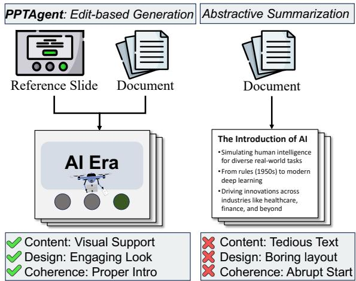  
Figure 1: Comparison between our PPTAGENT approach (left) and the conventional abstractive summarization method (right).

Existing approaches typically follow a text-toslides paradigm, which converts LLM outputs into slides using predefined rules or templates. As shown in Figure 1, prior studies (Mondal et al., 2024; Sefid et al., 2021) tend to treat presentation generation as an abstractive summarization task, focusing primarily on textual content while neglecting the visual-centric nature (Fu et al., 2022) of presentation. This results in text-heavy and monotonous presentations that fail to engage audiences effectively (Barrick et al., 2018).

Rather than creating complex presentations from scratch in a single pass, human workflows typically involve selecting exemplary slides as references and then summarizing and transferring key content onto them (Duarte, 2010). Inspired by this process, we propose PPTAGENT, which decomposes slide generation into two phases: selecting the reference slide and editing it step by step. However, achieving such an edit-based approach for presentation generation is challenging. First, due to the layout and modal complexity of presentations, it is difficult for LLMs to directly determine which slides should be referenced. The key challenge lies in enhancing LLMs’ understanding of reference presentations’ structure and content patterns. Second, most presentations are saved in PowerPoint’s XML format, as demonstrated in Figure 11, which is inherently verbose and redundant (Gryk, 2022), making it challenging for LLMs to robustly perform editing operations.

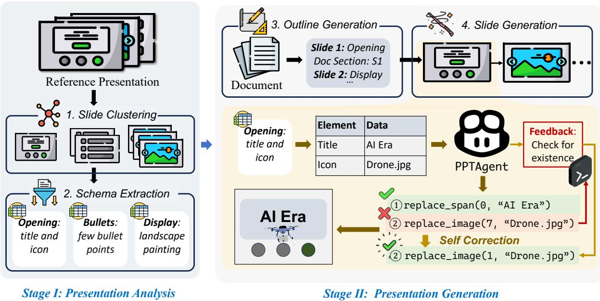  
Figure 2: Overview of the PPTAGENT workflow. StageI: Presentation Analysis involves analyzing the input presentation to cluster slides into groups and extract their content schemas. Stage II: Presentation Generation generates new presentations guided by the outline, incorporating self-correction mechanisms to ensure robustness.

To address these challenges, PPTAGENT operates in two stages. Stage I performs a comprehensive analysis of reference presentations to extract functional types and content schemas of slides, facilitating subsequent reference selection and slide generation. Stage II introduces a suite of edit APIs with HTML-rendered representation that simplifies slide modifications through code interaction (Wang et al., 2024b). Furthermore, we implement a selfcorrection mechanism (Kamoi et al., 2024) that allows LLMs to iteratively refine generated editing actions based on intermediate results and execution feedback, ensuring robust generation. As shown in Figure 2, we first analyze and cluster reference slides into categories (e.g., opening slides, bulletpoint slides). For each new slide, PPTAGENT selects an appropriate reference slide (e.g., opening slide for the first slide) and generates a series of editing actions (e.g., replace_span) to modify it.

Due to the lack of a comprehensive evaluation framework, we propose PPTEVAL, which adopts the MLLM-as-a-judge paradigm (Chen et al., 2024a) to evaluate presentations across three dimensions: Content, Design, and Coherence(Duarte, 2010). Human evaluations validate the reliability and effectiveness of PPTEVAL. Results demonstrate that PPTAGENT generates highquality presentations, achieving an average score of 3.67 for the three dimensions in PPTEVAL.

Our main contributions can be summarized as follows:

• We propose PPTAGENT, a framework that redefines automatic presentation generation as an edit-based process guided by reference presentations.

• We introduce PPTEVAL, a comprehensive evaluation framework that assesses presentations across three dimensions: Content, Design, and Coherence.

• We release the PPTAGENT and PPTEVAL codebases, along with a new presentation dataset Zenodo10K, to support future research.

# 2 PPTAGENT

In this section, we formulate the presentation generation task and introduce our proposed PPTAGENT framework, which consists of two distinct stages. In stage I, we analyze reference presentations through slide clustering and schema extraction, providing a comprehensive understanding of input presentations that facilitates subsequent reference selection and slide generation. In stage II, we leverage analyzed reference presentations to select reference slides and generate the target presentation for the input document through an iterative editing process. An overview of our workflow is illustrated in Figure 2.

# 2.1 Problem Formulation

PPTAGENT is designed to generate an engaging presentation through an edit-based process. We provide formal definitions for the conventional method and PPTAGENT to highlight their key differences.

The conventional method (Bandyopadhyay et al., 2024; Mondal et al., 2024) for creating each slide $\pmb { S }$ is formalized in Equation 1. Given the input content $C$ , it generates $n$ slide elements, each defined by its type, content, and styling attributes, such as (Textbox, "Hello", {border, size, position, . . . }).

$$
S = \{ e _ { 1 } , e _ { 2 } , \ldots , e _ { n } \} = f ( C )
$$

While this conventional method is straightforward, it requires manual specification of styling attributes, which is challenging for automated generation (Guo et al., 2023). Instead of creating slides from scratch, PPTAGENT generates a sequence of executable actions to edit reference slides, thereby preserving their well-designed layouts and styles. As shown in Equation 2, given the input content $C$ and the $j$ -th reference slide $R _ { j }$ , which is selected from the reference presentation, PPTAGENT generates a sequence of $m$ executable actions, where each action $a _ { i }$ corresponds to a line of executable code.

$$
A = \{ a _ { 1 } , a _ { 2 } , \ldots , a _ { m } \} = g ( C , R _ { j } )
$$

# 2.2 Stage I : Presentation Analysis

In this stage, we analyze the reference presentation to guide the reference selection and slide generation. Firstly, we categorize slides based on their structural and layout characteristics through slide clustering. Then, we extract content schemas to identify the content organization of the slide in each cluster, providing a comprehensive description of slide elements.

Slide Clustering Slides can be categorized into two main types based on their functionalities: structural slides that support the presentation’s organization (e.g., opening slides) and content slides that convey specific information (e.g., bullet-point slides). To distinguish between these two types, we employ LLMs to segment the presentation accordingly. For structural slides, we leverage LLMs’ long-context capability to analyze all slides in the input presentation, identifying structural slides, labeling their structural roles based on their textual features, and grouping them accordingly. For content slides, we first convert them into images and then apply a hierarchical clustering approach to group similar slide images. Subsequently, we utilize MLLMs to analyze the converted slide images, identifying layout patterns within each cluster. Further details are provided in Appendix D.

Schema Extraction After clustering, we further analyzed their content schemas to facilitate the slide generation. Specifically, we define an extraction framework where each element is represented by its category, description, and content. This framework enables a clear and structured representation of each slide. Detailed instructions are provided in Appendix F, with an example of the schema shown below.

<table><tr><td rowspan=1 colspan=1>Category</td><td rowspan=1 colspan=1>Description</td><td rowspan=1 colspan=1>Data</td></tr><tr><td rowspan=1 colspan=1>Title</td><td rowspan=1 colspan=1>Main title</td><td rowspan=1 colspan=1>SampleLibrary</td></tr><tr><td rowspan=1 colspan=1>Date</td><td rowspan=1 colspan=1>Date of the event</td><td rowspan=1 colspan=1>15February 2018</td></tr><tr><td rowspan=1 colspan=1>Image</td><td rowspan=1 colspan=1>Primaryimage toillustrate the slide</td><td rowspan=1 colspan=1>Picture: Children in a li-brary with...</td></tr></table>

# 2.3 Stage II : Presentation Generation

PPTAGENT first generates an outline specifying reference slides and relevant content for each new slide. Then, it iteratively edits elements from reference slides through edit APIs to create the target presentation.

Outline Generation As shown in Figure 2, we utilize LLM to generate a structured outline consisting of multiple entries. Each entry represents a new slide, containing the reference slide and relevant document content of the new slide. The reference slide is selected based on the slide-level functional description in Stage I, while the relevant document content is identified based on the input document.

Slide Generation Guided by the structured outline, slides are generated iteratively based on the corresponding entries. For each slide, LLMs incorporate textual content and extracted image captions from the input document. The new slide adopts the layout of the reference slide while ensuring consistency in content and structural clarity.

Specifically, to generate a new slide based on the corresponding entry in the outline, we design editbased APIs to enable LLMs to edit the reference slide. As shown below, these APIs support editing, removing, and duplicating slide elements. Moreover, given the complexity of the XML format in presentations, which is demonstrated in Appendix E, we render the reference slide into an HTML representation (Feng et al., 2024), offering a more precise and intuitive format for easier understanding. This HTML-based format, combined with our edit-based APIs, enables LLMs to perform precise content modifications on reference slides.

<table><tr><td>Function Name</td><td>Description</td></tr><tr><td>del_span</td><td>Delete a span.</td></tr><tr><td>del_image</td><td>Delete an image element.</td></tr><tr><td>clone_paragraph</td><td>Create a duplicate of an existing paragraph.</td></tr><tr><td>replace_span</td><td>Replace the content of a span.</td></tr><tr><td>replace_image</td><td>Replace the source of image.</td></tr></table>

Furthermore, to enhance robustness during the editing process, we implement a self-correction mechanism (Kamoi et al., 2024). Specifically, the generated editing actions are executed within a REPL1 environment. When actions fail to apply to reference slides, the REPL provides execution feedback2 to assist LLMs in refining their actions. The LLM then analyzes this feedback to adjust its editing actions (Guan et al., 2024; Wang et al., 2024b), enabling iterative refinement until a valid slide is generated or the maximum retry limit is reached.

# 3 PPTEVAL

We introduce PPTEVAL, a comprehensive framework that evaluates presentation quality from multiple dimensions, addressing the absence of reference-free evaluation for presentations. The framework provides both numeric scores (1-to-5 scale) and detailed rationales to justify each dimension’s assessment.

Grounded in established presentation design principles (Duarte, 2008, 2010), our evaluation framework focuses on three key dimensions, as summarized in Table 1. Specially, given a generated presentation, we assess the content and design at the slide level, while evaluating coherence across the entire presentation.

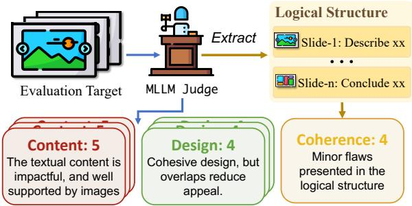  
Figure 3: PPTEVAL assesses presentations from three dimensions: content, design, and coherence.

The complete evaluation process is illustrated in Figure 3, with detailed scoring criteria and representative examples provided in Appendix B.

<table><tr><td>Dimension</td><td>Criteria</td></tr><tr><td>Content</td><td>Text should be concise and grammatically sound,supported by relevant images.</td></tr><tr><td>Design</td><td>Harmonious colors and proper layout ensure readability,while visual elements like geo- metric shapes enhance the overall appeal.</td></tr><tr><td>Coherence</td><td>Structure develops progressively,incorporat- ing essential background information.</td></tr></table>

Table 1: The scoring criteria of dimensions in PPTEVAL, all evaluated in 1-5 scale.

# 4 Experiment

# 4.1 Dataset

Existing presentation datasets, such as Fu et al. (2022); Mondal et al. (2024); Sefid et al. (2021); Sun et al. (2021), have two main issues. First, they are mostly stored in PDF or JSON formats, which leads to a loss of semantic information, such as structural relationships and styling attributes of elements. Additionally, these datasets primarily consist of academic presentations in artificial intelligence, limiting their diversity. To address these limitations, we introduce Zenodo10K, a new dataset sourced from Zenodo (European Organization For Nuclear Research and OpenAIRE, 2013), which hosts diverse artifacts across domains, all under clear licenses. We have curated 10,448 presentations from this source and made them publicly available to support further research.

Following Mondal et al. (2024), we sample 50 presentations in five domains to serve as reference presentations. In addition, we collected 50 documents from the same domains to be used as input documents. The sampling criteria and preprocessing details are provided in Appendix A, while the dataset statistics are summarized in Table 2.

Table 2: Statistics of the dataset used in our experiments, detailing the number of characters (‘#Chars’) and figures (‘#Figs’), as well as the number of pages (‘#Pages’).   

<table><tr><td rowspan="2">Domain</td><td colspan="2">Document</td><td colspan="3">Presentation</td></tr><tr><td>#Chars</td><td>#Figs</td><td>#Chars</td><td>#Figs</td><td>#Pages</td></tr><tr><td>Culture</td><td>12,708</td><td>2.9</td><td>6,585</td><td>12.8</td><td>14.3</td></tr><tr><td>Education</td><td>12,305</td><td>5.5</td><td>3,993</td><td>12.9</td><td>13.9</td></tr><tr><td>Science</td><td>16,661</td><td>4.8</td><td>5,334</td><td>24.0</td><td>18.4</td></tr><tr><td>Society</td><td>13,019</td><td>7.3</td><td>3,723</td><td>9.8</td><td>12.9</td></tr><tr><td>Tech</td><td>18,315</td><td>11.4</td><td>5,325</td><td>12.9</td><td>16.8</td></tr></table>

# 4.2 Implementation Details

PPTAGENT is implemented with three models: GPT-4o-2024-08-06 (GPT-4o), Qwen2.5-72BInstruct (Qwen2.5, Yang et al., 2024), and Qwen2- VL-72B-Instruct (Qwen2-VL, Wang et al., 2024a). These models are categorized according to the specific modalities they handle, whether textual or visual, as indicated by their subscripts. Specifically, we define configurations as combinations of a language model (LM) and a vision model (VM), such as $\mathrm { Q w e n } 2 . 5 _ { L M } + \mathrm { Q w e n } 2 - \mathrm { V L } _ { \forall M }$ .

Experiment data covers 5 domains, each with 10 input documents and 10 reference presentations, totaling 500 presentation generation tasks per configuration (5 domains $\times 1 0$ input documents $\times 1 0$ reference presentations). Each slide generation allows a maximum of two self-correction iterations. We use Chen et al. (2024b) and $\mathrm { { W u } }$ et al. (2020) to compute the text and image embeddings respectively. All open-source LLMs are deployed using the VLLM framework (Kwon et al., 2023) on NVIDIA A100 GPUs. The total computational cost for experiments are approximately 500 GPU hours.

# 4.3 Baselines

We choose the following baseline methods: DocPres (Bandyopadhyay et al., 2024) propose a rule-based approach that generates narrativerich slides through multi-stages, and incorporates images through a similarity-based mechanism. KCTV (Cachola et al., 2024) propose a templatebased method that creates slides in an intermediate format before converting them into final presentations using predefined templates. The baseline methods operate without vision models since they do not process visual information. Each configuration generates 50 presentations (5 domains $\times$ 10 input documents), as they do not require reference presentations. Consequently, the FID metric is excluded from their evaluation.

# 4.4 Evaluation Metrics

We evaluated the presentation generation using the following metrics:

• Success Rate (SR) evaluates the robustness of presentation generation (Wu et al., 2024), calculated as the percentage of successfully completed tasks. For PPTAGENT, success requires the generation of all slides without execution errors after self-correction. For KCTV, success is determined by the successful compilation of the generated LaTeX file. DocPres is excluded from this evaluation due to its deterministic rule-based conversion.

• Perplexity (PPL) measures the likelihood of the model generating the given sequence. Using Llama-3-8B (Dubey et al., 2024), we calculate the average perplexity across all slides in a presentation. Lower perplexity scores indicate higher textual fluency (Bandyopadhyay et al., 2024).

• Rouge-L (Lin, 2004) evaluates textual similarity by measuring the longest common subsequence between generated and reference texts. We report the F1 score to balance precision and recall.

• FID (Heusel et al., 2017) measures the similarity between the generated presentation and the reference presentation in the feature space. Due to the limited sample size, we calculate the FID using a 64-dimensional output vector.

• PPTEVAL employs GPT-4o as the judging model to evaluate presentation quality across three dimensions: content, design, and coherence. We compute content and design scores by averaging across slides, while coherence is assessed at the presentation level.

# 4.5 Overall Result

Table 3 presents the performance comparison between PPTAGENT and baselines, revealing that:

PPTAGENT Significantly Improves Overall Presentation Quality. PPTAGENT demonstrates statistically significant performance improvements over baseline methods across all three dimensions of PPTEVAL. Compared to the rule-based baseline (DocPres), PPTAGENT exhibits substantial improvements in both the design and content dimensions (3.34 vs. 2.37, $+ 4 0 . 9 \%$ ; 3.34 vs. 2.98, $+ 1 2 . 1 \% )$ , as presentations generated by the DocPres method show minimal design effort. In comparison with the template-based baseline (KCTV), PPTAGENT also achieves notable improvements in both design and content (3.34 vs. 2.95, $+ 1 3 . 2 \%$ ; 3.28 vs. 2.55, $+ 2 8 . 6 \%$ ), underscoring the efficacy of the editbased paradigm. Most notably, PPTAGENT shows a significant enhancement in the coherence dimension (4.48 vs. 3.57, $+ 2 5 . 5 \%$ for DocPres; 4.48 vs. 3.28, $+ 3 6 . 6 \%$ for KCTV). This improvement can be attributed to PPTAGENT ’s comprehensive analysis of the structural role of slides.

Table 3: Performance comparison of presentation generation methods, including DocPres, KCTV, and our proposed PPTAGENT. The best/second-best scores are bolded/underlined. Results are reported using existing metrics, including Success Rate (SR), Perplexity (PPL), Rouge-L, Fréchet Inception Distance (FID), and PPTEval.   

<table><tr><td colspan="2">Configuration</td><td colspan="4">Existing Metrics</td><td colspan="4">PPTEVAL</td></tr><tr><td>Language ModelVision ModelSR(%)↑</td><td></td><td></td><td>PPL↓</td><td>ROUGE-L↑</td><td>FID↓</td><td>Content↑</td><td>Design↑</td><td>Coherence↑</td><td>Avg.↑</td></tr><tr><td colspan="10">DocPres (rule-based)</td></tr><tr><td>GPT-40Lm</td><td></td><td></td><td>76.42</td><td>13.28</td><td></td><td>2.98</td><td>2.33</td><td>3.24</td><td>2.85</td></tr><tr><td>Qwen2.5LM</td><td></td><td></td><td>100.4</td><td>13.09</td><td></td><td>2.96</td><td>2.37</td><td>3.28</td><td>2.87</td></tr><tr><td colspan="10"> KCTV (template-based)</td></tr><tr><td>GPT-40LM</td><td></td><td>80.0</td><td>68.48</td><td>10.27</td><td>1</td><td>2.49</td><td>2.94</td><td>3.57</td><td>3.00</td></tr><tr><td>Qwen2.5LM</td><td></td><td>88.0</td><td>41.41</td><td>16.76</td><td></td><td>2.55</td><td>2.95</td><td>3.36</td><td>2.95</td></tr><tr><td colspan="10"> PPTAGENT (ours)</td></tr><tr><td>GPT-40LM</td><td>GPT-40vM</td><td>97.8</td><td>721.54</td><td>10.17</td><td>7.48</td><td>3.25</td><td>3.24</td><td>4.39</td><td>3.62</td></tr><tr><td>Qwen2-VLLM</td><td>Qwen2-VLvM</td><td>43.0</td><td>265.08</td><td>13.03</td><td>7.32</td><td>3.13</td><td>3.34</td><td>4.07</td><td>3.51</td></tr><tr><td>Qwen2.5LM</td><td>Qwen2-VLvM</td><td>95.0</td><td>496.62</td><td>14.25</td><td>6.20</td><td>3.28</td><td>3.27</td><td>4.48</td><td>3.67</td></tr></table>

Table 4: Ablation analysis of PPTAGENT utilizing the $\mathrm { Q w e n } 2 . 5 _ { L M } + \mathrm { Q w e n } 2 - \mathrm { V L } _ { \forall M }$ configuration, demonstrating the contribution of each components.   

<table><tr><td>Setting</td><td>SR(%)</td><td>Content</td><td>Design</td><td>Coherence</td><td>Avg.</td></tr><tr><td>PPTAGENT</td><td>95.0</td><td>3.28</td><td>3.27</td><td>4.48</td><td>3.67</td></tr><tr><td>w/o Outline</td><td>91.0</td><td>3.24</td><td>3.30</td><td>3.36</td><td>3.30</td></tr><tr><td>w/o Schema</td><td>78.8</td><td>3.08</td><td>3.23</td><td>4.04</td><td>3.45</td></tr><tr><td>w/o Structure</td><td>92.2</td><td>3.28</td><td>3.25</td><td>3.45</td><td>3.32</td></tr><tr><td>w/o CodeRender</td><td>74.6</td><td>3.27</td><td>3.34</td><td>4.38</td><td>3.66</td></tr></table>

PPTAGENT Exhibits Robust Generation Performance. Our approach empowers LLMs to produce well-rounded presentations with remarkable success rate, achieving $\geq 9 5 \%$ success rate for both Qwen $2 . 5 _ { L M } + \mathrm { Q w e n } 2 - \mathrm { V L } _ { \mathsf { V M } }$ and GPT- $4 0 _ { \mathsf { L M } } + \mathbf { G P T } -$ $4 0 \nu _ { \sf M }$ , which is a significant improvement compared to KCTV $( 9 7 . 8 \%$ vs. $8 8 . 0 \%$ ). Moreover, detailed performance of $\mathrm { Q w e n } 2 . 5 _ { L M } + \mathrm { Q w e n } 2 - \mathrm { V L } _ { \forall M }$ across various domains is illustrated in Table 8, underscoring the versatility and robustness of our approach.

PPTEVAL Demonstrates Superior Evaluation Capability. Traditional metrics like PPL and ROUGE-L demonstrate inconsistent evaluation trends compared to PPTEVAL. For instance, KCTV achieves a high ROUGE-L (16.76) but a low content score (2.55), while our method shows the opposite trend with ROUGE-L (14.25) and content score (3.28). Moreover, we observe that

ROUGE score overemphasizes textual alignment with source documents, potentially compromising the expressiveness of presentations. Most importantly, PPTEVAL advances beyond existing metrics through its dual capability of reference-free design assessment and holistic evaluation of presentation coherence. Further agreement evaluation is shown in Section 5.5.

# 5 Analysis

# 5.1 Ablation Study

We conducted ablation studies across four settings: (1) randomly selecting a slide as the reference (w/o Outline), (2) omitting structural slides during outline generation (w/o Structure), (3) replacing the slide representation with the method proposed by Guo et al. (2023) (w/o CodeRender), and (4) removing guidance from the content schema (w/o Schema). All experiments were conducted using the $\mathrm { Q w e n } 2 . 5 _ { L M } + \mathrm { Q w e n } 2 - \mathrm { V L } _ { \forall M }$ configuration.

As demonstrated in Table 4, our experiments reveal two key findings: 1) The HTML-based representation significantly reduces interaction complexity, evidenced by the substantial decrease in success rate from $9 5 . 0 \%$ to $7 4 . 6 \%$ when removing the Code Render component. 2) The presentation analysis is crucial for generation quality, as removing the outline and structural slides significantly degrades coherence (from 4.48 to 3.36/3.45) and eliminating the slide schema reduces the success rate from $9 5 . 0 \%$ to $7 8 . 8 \%$ .

# 5.2 Case Study

We present representative examples of presentations generated under different configurations in

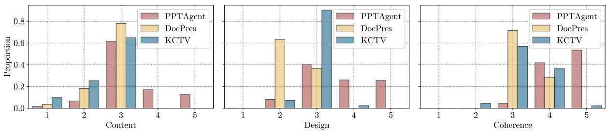  
Figure 4: Score distributions of presentations generated by PPTAGENT, DocPres, and KCTV across the three evaluation dimensions: Content, Design, and Coherence, as assessed by PPTEVAL.

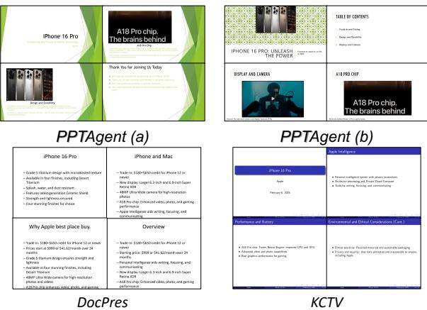  
Figure 5: Comparative analysis of presentation generation across different methods. PPTAGENT generates under different reference presentations, indicated as PPTAGENT (a) and PPTAGENT $( b )$ .

# 5.3 Score Distribution

We further investigated the score distribution of generated presentations to compare the performance characteristics across methods, as shown in Figure 4. Constrained by their rule-based or template-based paradigms, baseline methods exhibit limited diversity in both content and design dimensions, with scores predominantly concentrated at levels 2 and 3. In contrast, PPTAGENT demonstrates a more dispersed score distribution, with the majority of presentations $( > 8 0 \% )$ achieving scores of 3 or higher in these dimensions. Furthermore, due to PPTAGENT’s comprehensive consideration of structural slides, it achieves notably superior coherence scores, with over $80 \%$ of the presentations receiving scores above 4.

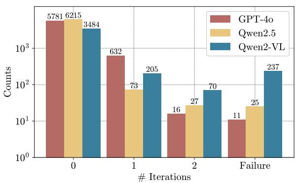  
Figure 5. PPTAGENT demonstrates superior presentation quality across multiple dimensions. First, it effectively incorporates visual elements with contextually appropriate image placements, while maintaining concise and well-structured slide content. Second, it exhibits diversity in generating visually engaging slides under diverse references. In contrast, baseline methods (DocPres and KCTV) produce predominantly text-based slides with limited visual variation, constrained by their rulebased or template-based paradigms.   
Figure 6: The number of iterative self-corrections required to generate a single slide under different models.

# 5.4 Effectiveness of Self-Correction

Figure 6 illustrates the number of iterations required to generate a slide using different language models. Although GPT-4o exhibits superior self-correction capabilities compared to Qwen2.5, Qwen2.5 encounters fewer errors in the first generation. Additionally, we observed that Qwen2-VL experiences errors more frequently and has poorer self-correction capabilities, likely due to its multimodal post-training (Wang et al., 2024a). Ultimately, all three models successfully corrected more than half of the errors, demonstrating that our iterative self-correction mechanism effectively ensures the success of the generation process.

# 5.5 Agreement Evaluation

PPTEVAL with Human Preferences Despite Chen et al. (2024a) have highlighted the impressive human-like discernment of LLMs in various generation tasks. However, it remains crucial to assess the correlation between LLM evaluations and human evaluations in the context of presentations. This necessity arises from findings by Laskar et al. (2024), which indicate that LLMs may not be adequate evaluators for complex tasks. Table 5 shows the correlation of ratings between humans and LLMs. The average Pearson correlation of 0.71 exceeds the scores of other evaluation methods (Kwan et al., 2024), indicating that PPTEVAL aligns well with human preferences.

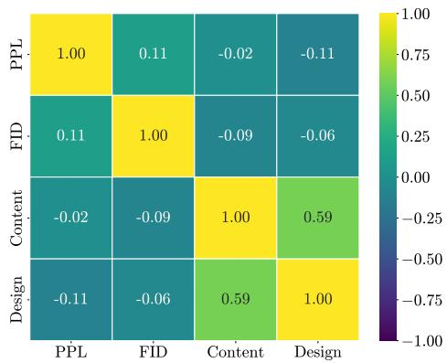  
Figure 7: Correlation heatmap between existing automated evaluation metrics along with the content and design dimension in PPTEVAL.

PPTEVAL with Existing Metrics We analyzed the relationships between PPTEVAL’s content and design dimensions and existing metrics through Pearson correlation analysis, as shown in Figure 7. The Pearson correlation coefficients reveal that current metrics are ineffective for presentation evaluation. Specifically, PPL primarily measures text fluency but performs poorly on slide content due to its inherent fragmented nature, frequently producing outlier measurements. Similarly, while ROUGEL and FID quantify similarity to reference text and presentations respectively, these metrics inadequately assess content and design quality, as high conformity to references does not guarantee presentation effectiveness. These weak correlations highlight the necessity of PPTEVAL for robust and comprehensive presentation evaluation that considers both content quality and design effectiveness.

# 6 Related Works

Automated Presentation Generation Recent proposed methods for slide generation can be categorized into rule-based and template-based based on how they handle element placement and styling. Rule-based methods, such as those proposed by Mondal et al. (2024) and Bandyopadhyay et al. (2024), often focus on enhancing textual content but neglect the visual-centric nature of presentations, leading to outputs that lack engagement. Template-based methods, including Cachola et al. (2024) and industrial solutions like Tongyi, rely on predefined templates to create visually appealing presentations. However, their dependence on extensive manual effort for template annotation significantly limits scalability and flexibility.

Table 5: The correlation scores between human ratings and LLM ratings under different dimensions (Coherence, Content, Design). All presented data of similarity exhibit a p-value below 0.05, indicating a statistically significant level of confidence.   

<table><tr><td>Correlation</td><td>Content</td><td>Design</td><td>Coherence</td><td>Avg.</td></tr><tr><td>Pearson</td><td>0.70</td><td>0.90</td><td>0.55</td><td>0.71</td></tr><tr><td> Spearman</td><td>0.73</td><td>0.88</td><td>0.57</td><td>0.74</td></tr></table>

LLM Agent Numerous studies (Deng et al., 2024; Li et al., 2024; Tang et al., 2025) have explored the potential of LLMs to act as agents assisting humans in a wide array of tasks. For example, Wang et al. (2024b) demonstrate the capability of LLMs to accomplish tasks by generating executable actions. Furthermore, Guo et al. (2023) demonstrated the potential of LLMs in automating presentation-related tasks through API integration.

LLM as a Judge LLMs have exhibited strong capabilities in instruction following and context perception, which has led to their widespread adoption as judges (Liu et al., 2023; Zheng et al., 2023). Chen et al. (2024a) demonstrated the feasibility of using MLLMs as judges, while Kwan et al. (2024) proposed a multi-dimensional evaluation framework. Additionally, Ge et al. (2025) investigated the use of LLMs for assessing single-slide quality. However, they did not evaluate presentation quality from a holistic perspective.

# 7 Conclusion

In this paper, we introduce PPTAGENT, which conceptualizes presentation generation as a two-stage presentation editing task completed through LLMs’ abilities to understand and generate code. Moreover, we propose PPTEVAL to provide quantitative metrics for assessing presentation quality. Our experiments across data from multiple domains have demonstrated the superiority of our method. This research provides a new paradigm for generating slides under unsupervised conditions and offers insights for future work in presentation generation.

# Limitations

While PPTAGENT demonstrates promising capabilities in presentation generation, several limitations remain. First, despite achieving a high success rate $( > 9 5 \% )$ on our dataset, the model occasionally fails to generate presentations, which could limit its reliability. Second, although we can provide highquality preprocessed presentations as references, the quality of generated presentations is still influenced by the input reference presentation, which may lead to suboptimal outputs. Third, although PPTAGENT shows improvements in layout optimization compared to prior approaches, it does not fully utilize visual information to refine the slide design. This manifests in occasional design flaws, such as overlapping elements, which can compromise the readability of generated slides. Future work should focus on enhancing the robustness, reducing reference dependency, and better incorporating visual information into the generation process.

# Ethical Considerations

In the construction of Zenodo10K, we utilized the publicly available API to scrape data while strictly adhering to the licensing terms associated with each artifact. Specifically, artifacts that were not permitted for modification or commercial use under their respective licenses were filtered out to ensure compliance with intellectual property rights. Additionally, all annotation personnel involved in the project were compensated at rates exceeding the minimum wage in their respective cities, reflecting our commitment to fair labor practices and ethical standards.

# References

Sambaran Bandyopadhyay, Himanshu Maheshwari, Anandhavelu Natarajan, and Apoorv Saxena. 2024. Enhancing presentation slide generation by llms with a multi-staged end-to-end approach. arXiv preprint arXiv:2406.06556.

Andrea Barrick, Dana Davis, and Dana Winkler. 2018. Image versus text in powerpoint lectures: Who does it benefit? Journal of Baccalaureate Social Work, 23(1):91–109.

Isabel Alyssa Cachola, Silviu Cucerzan, Allen Herring, Vuksan Mijovic, Erik Oveson, and Sujay Kumar Jauhar. 2024. Knowledge-centric templatic views of documents. In Findings of the Association for Computational Linguistics: EMNLP 2024, pages

15460–15476, Miami, Florida, USA. Association for Computational Linguistics.

Dongping Chen, Ruoxi Chen, Shilin Zhang, Yinuo Liu, Yaochen Wang, Huichi Zhou, Qihui Zhang, Pan Zhou, Yao Wan, and Lichao Sun. 2024a. Mllmas-a-judge: Assessing multimodal llm-as-a-judge with vision-language benchmark. arXiv preprint arXiv:2402.04788.

Jianlv Chen, Shitao Xiao, Peitian Zhang, Kun Luo, Defu Lian, and Zheng Liu. 2024b. Bge m3-embedding: Multi-lingual, multi-functionality, multi-granularity text embeddings through self-knowledge distillation. arXiv preprint arXiv:2402.03216.

Xiang Deng, Yu Gu, Boyuan Zheng, Shijie Chen, Sam Stevens, Boshi Wang, Huan Sun, and Yu Su. 2024. Mind2web: Towards a generalist agent for the web. Advances in Neural Information Processing Systems, 36.

Nancy Duarte. 2008. Slide: ology: The art and science of creating great presentations, volume 1. O’Reilly Media Sebastapol.

Nancy Duarte. 2010. Resonate: Present visual stories that transform audiences. John Wiley & Sons.

Abhimanyu Dubey, Abhinav Jauhri, Abhinav Pandey, Abhishek Kadian, Ahmad Al-Dahle, Aiesha Letman, Akhil Mathur, Alan Schelten, Amy Yang, Angela Fan, et al. 2024. The llama 3 herd of models. arXiv preprint arXiv:2407.21783.

European Organization For Nuclear Research and OpenAIRE. 2013. Zenodo.

Weixi Feng, Wanrong Zhu, Tsu-jui Fu, Varun Jampani, Arjun Akula, Xuehai He, Sugato Basu, Xin Eric Wang, and William Yang Wang. 2024. Layoutgpt: Compositional visual planning and generation with large language models. Advances in Neural Information Processing Systems, 36.

Tsu-Jui Fu, William Yang Wang, Daniel McDuff, and Yale Song. 2022. Doc2ppt: Automatic presentation slides generation from scientific documents. Proceedings of the AAAI Conference on Artificial Intelligence, 36(1):634–642.

Jiaxin Ge, Zora Zhiruo Wang, Xuhui Zhou, Yi-Hao Peng, Sanjay Subramanian, Qinyue Tan, Maarten Sap, Alane Suhr, Daniel Fried, Graham Neubig, et al. 2025. Autopresent: Designing structured visuals from scratch. arXiv preprint arXiv:2501.00912.

Michael Robert Gryk. 2022. Human readability of data files. Balisage series on markup technologies, 27.

Xinyan Guan, Yanjiang Liu, Hongyu Lin, Yaojie Lu, Ben He, Xianpei Han, and Le Sun. 2024. Mitigating large language model hallucinations via autonomous knowledge graph-based retrofitting. In Proceedings of the AAAI Conference on Artificial Intelligence, volume 38, pages 18126–18134.

Yiduo Guo, Zekai Zhang, Yaobo Liang, Dongyan Zhao, and Duan Nan. 2023. Pptc benchmark: Evaluating large language models for powerpoint task completion. arXiv preprint arXiv:2311.01767.

Martin Heusel, Hubert Ramsauer, Thomas Unterthiner, Bernhard Nessler, and Sepp Hochreiter. 2017. Gans trained by a two time-scale update rule converge to a local nash equilibrium. Advances in neural information processing systems, 30.

Ryo Kamoi, Yusen Zhang, Nan Zhang, Jiawei Han, and Rui Zhang. 2024. When can llms actually correct their own mistakes? a critical survey of selfcorrection of llms. Transactions of the Association for Computational Linguistics, 12:1417–1440.

Wai-Chung Kwan, Xingshan Zeng, Yuxin Jiang, Yufei Wang, Liangyou Li, Lifeng Shang, Xin Jiang, Qun Liu, and Kam-Fai Wong. 2024. Mt-eval: A multiturn capabilities evaluation benchmark for large language models. Preprint, arXiv:2401.16745.

Woosuk Kwon, Zhuohan Li, Siyuan Zhuang, Ying Sheng, Lianmin Zheng, Cody Hao Yu, Joseph Gonzalez, Hao Zhang, and Ion Stoica. 2023. Efficient memory management for large language model serving with pagedattention. In Proceedings of the 29th Symposium on Operating Systems Principles, pages 611–626.

Md Tahmid Rahman Laskar, Sawsan Alqahtani, M Saiful Bari, Mizanur Rahman, Mohammad Abdullah Matin Khan, Haidar Khan, Israt Jahan, Amran Bhuiyan, Chee Wei Tan, Md Rizwan Parvez, Enamul Hoque, Shafiq Joty, and Jimmy Huang. 2024. A systematic survey and critical review on evaluating large language models: Challenges, limitations, and recommendations. In Proceedings of the 2024 Conference on Empirical Methods in Natural Language Processing, pages 13785–13816, Miami, Florida, USA. Association for Computational Linguistics.

Yanda Li, Chi Zhang, Wanqi Yang, Bin Fu, Pei Cheng, Xin Chen, Ling Chen, and Yunchao Wei. 2024. Appagent v2: Advanced agent for flexible mobile interactions. arXiv preprint arXiv:2408.11824.

Chin-Yew Lin. 2004. ROUGE: A package for automatic evaluation of summaries. In Text Summarization Branches Out, pages 74–81, Barcelona, Spain. Association for Computational Linguistics.

Yang Liu, Dan Iter, Yichong Xu, Shuohang Wang, Ruochen Xu, and Chenguang Zhu. 2023. G-eval: NLG evaluation using gpt-4 with better human alignment. In Proceedings of the 2023 Conference on Empirical Methods in Natural Language Processing, pages 2511–2522, Singapore. Association for Computational Linguistics.

Himanshu Maheshwari, Sambaran Bandyopadhyay, Aparna Garimella, and Anandhavelu Natarajan. 2024. Presentations are not always linear! gnn meets llm for document-to-presentation transformation with attribution. arXiv preprint arXiv:2405.13095.

Ishani Mondal, S Shwetha, Anandhavelu Natarajan, Aparna Garimella, Sambaran Bandyopadhyay, and Jordan Boyd-Graber. 2024. Presentations by the humans and for the humans: Harnessing llms for generating persona-aware slides from documents. In Proceedings of the 18th Conference of the European Chapter of the Association for Computational Linguistics (Volume 1: Long Papers), pages 2664–2684.

Athar Sefid, Prasenjit Mitra, and Lee Giles. 2021. Slidegen: an abstractive section-based slide generator for scholarly documents. In Proceedings of the 21st ACM Symposium on Document Engineering, pages 1–4.

Edward Sun, Yufang Hou, Dakuo Wang, Yunfeng Zhang, and Nancy XR Wang. 2021. D2s: Documentto-slide generation via query-based text summarization. arXiv preprint arXiv:2105.03664.

Hao Tang, Darren Key, and Kevin Ellis. 2025. Worldcoder, a model-based llm agent: Building world models by writing code and interacting with the environment. Advances in Neural Information Processing Systems, 37:70148–70212.

VikParuchuri. 2023. marker.

Peng Wang, Shuai Bai, Sinan Tan, Shijie Wang, Zhihao Fan, Jinze Bai, Keqin Chen, Xuejing Liu, Jialin Wang, Wenbin Ge, et al. 2024a. Qwen2-vl: Enhancing vision-language model’s perception of the world at any resolution. arXiv preprint arXiv:2409.12191.

Xingyao Wang, Yangyi Chen, Lifan Yuan, Yizhe Zhang, Yunzhu Li, Hao Peng, and Heng Ji. 2024b. Executable code actions elicit better llm agents. arXiv preprint arXiv:2402.01030.

Bichen Wu, Chenfeng Xu, Xiaoliang Dai, Alvin Wan, Peizhao Zhang, Zhicheng Yan, Masayoshi Tomizuka, Joseph Gonzalez, Kurt Keutzer, and Peter Vajda. 2020. Visual transformers: Token-based image representation and processing for computer vision. Preprint, arXiv:2006.03677.

Tong Wu, Guandao Yang, Zhibing Li, Kai Zhang, Ziwei Liu, Leonidas Guibas, Dahua Lin, and Gordon Wetzstein. 2024. Gpt-4v (ision) is a human-aligned evaluator for text-to-3d generation. In Proceedings of the IEEE/CVF Conference on Computer Vision and Pattern Recognition, pages 22227–22238.

An Yang, Baosong Yang, Beichen Zhang, Binyuan Hui, Bo Zheng, Bowen Yu, Chengyuan Li, Dayiheng Liu, Fei Huang, Haoran Wei, et al. 2024. Qwen2. 5 technical report. arXiv preprint arXiv:2412.15115.

Lianmin Zheng, Wei-Lin Chiang, Ying Sheng, Siyuan Zhuang, Zhanghao Wu, Yonghao Zhuang, Zi Lin, Zhuohan Li, Dacheng Li, Eric Xing, et al. 2023. Judging llm-as-a-judge with mt-bench and chatbot arena. Advances in Neural Information Processing Systems, 36:46595–46623.

# A Data Preprocessing

To maintain a reasonable cost, we selected presentations ranging from 12 to 64 pages and documents with text lengths from 2,048 to 20,480 characters. We extracted both textual and visual content from the source documents using VikParuchuri (2023). The extracted text was then organized into sections. For visual content, we generated image captions to assist in relevant image selection through textual descriptions. To minimize redundancy, we identified and removed duplicate images if their image embeddings had a cosine similarity score exceeding 0.85. For slide-level deduplication, we removed individual slides if their text embeddings had a cosine similarity score above 0.8 compared to the preceding slide, as suggested by Fu et al. (2022).

# B Details of PPTEVAL

We recruited four graduate students through a Shanghai-based crowdsourcing platform to evaluate a total of 250 presentations: 50 randomly selected from Zenodo10K representing real-world presentations, along with two sets of 100 presentations generated by the baseline method and our approach respectively. Following the evaluation framework proposed by PPTEVAL, assessments were conducted across three dimensions using the scoring criteria detailed in Appendix F. Evaluators were provided with converted slide images, scored them individually, and then discussed the results to reach a consensus on the final scores.

Moreover, We measured inter-rater agreement using Fleiss’ Kappa, with an average score of 0.59 across three dimensions (0.61, 0.61, 0.54 for Content, Design, and Coherence, respectively) indicating satisfactory agreement (Kwan et al., 2024) among evaluators. Representative scoring examples are shown in Figure 8.

We provided detailed illustration as below:

Content: The content dimension evaluates the information presented on the slides, focusing on both text and images. We assess content quality from three perspectives: the amount of information, the clarity and quality of textual content, and the support provided by visual content. High-quality textual content is characterized by clear, impactful text that conveys the proper amount of information. Additionally, images should complement and reinforce the textual content, making the information more accessible and engaging. To evaluate content quality, we employ MLLMs on slide images, as slides cannot be easily comprehended in a plain text format.

Design: Good design not only captures attention but also enhances content delivery. We evaluate the design dimension based on three aspects: color schemes, visual elements, and overall design. Specifically, the color scheme of the slides should have clear contrast to highlight the content while maintaining harmony. The use of visual elements, such as geometric shapes, can make the slide design more expressive. Finally, good design should adhere to basic design principles, such as avoiding overlapping elements and ensuring that design does not interfere with content delivery.

Coherence: Coherence is essential for maintaining audience engagement in a presentation. We evaluate coherence based on the logical structure and the contextual information provided. Effective coherence is achieved when the model constructs a captivating storyline, enriched with contextual information that enables the audience to follow the content seamlessly. We assess coherence by analyzing the logical structure and contextual information extracted from the presentation.

# C Detailed Performance of PPTAGENT

We present a detailed performance analysis of Qwen2.5LM+Qwen2-VLVM across various domains in Table 8. Additionally, Table 7 and 6 show the success rate-weighted performance, where failed generations receive a PPTEVAL score of 0, demonstrating that a lower success rate significantly impacts the overall effectiveness of the method.

As demonstrated in Table 6. GPT-4o consistently demonstrates outstanding performance across various evaluation metrics, highlighting its advanced capabilities. While Qwen2-VL exhibits limitations in linguistic proficiency due to the trade-offs from multimodal post-training, GPT-4o maintains a clear advantage in handling language tasks. However, the introduction of Qwen2.5 successfully mitigates these linguistic deficiencies, bringing its performance on par with GPT-4o, and achieving the best performance. This underscores the significant potential of open-source LLMs as competitive and highly capable presentation agents.

# D Slide Clustering

We present our hierarchical clustering algorithm for layout analysis in Algorithm 1, where slides are grouped into clusters using a similarity threshold $\theta$ of 0.65. To focus exclusively on layout patterns and minimize interference from specific content, we preprocess the slides by replacing text content with a placeholder character (“a”) and substituting image elements with solid-color backgrounds. Then, we compute the similarity matrix using cosine similarity based on the ViT embeddings of converted slide images between each slide pair. Figure 9 illustrates representative examples from the resulting slide clusters.

1: Input: Similarity matrix of slides S ∈ RN×N , similarity threshold $\theta$   
2: Initialize: $C  \emptyset$   
3: while $\operatorname* { m a x } ( S ) \geq \theta$ do   
4: $( i , j ) \gets \arg \operatorname* { m a x } ( S )$ $\triangleright$ Find the most similar slide pair   
5: if $\exists c _ { k } \in C$ such that $( i \in c _ { k } \lor j \in c _ { k } )$ then   
6: ck ← ck ∪ {i, j} ▷ Merge into existing cluster   
7: else   
8: cnew ← {i, j} ▷ Create new cluster   
9: C ← C ∪ {cnew}   
10: end if   
11: Update $S$ :   
12: $\begin{array} { c } { { S [ : , i ]  0 , S [ i , : ]  0 } } \\ { { S [ : , j ]  0 , S [ j , : ]  0 } } \end{array}$   
13:   
14: end while   
15: Return: $C$

# E Code Interaction

For visual reference, Figure 10 illustrates a slide rendered in HTML format, while Figure 11 displays its excerpt (first 60 lines) of the XML representation (out of 1,006 lines).

# F Prompts

# F.1 Prompts for Presentation Analysis

The prompts used for presentation analysis are illustrated in Figures 12, 13, and 14.

# F.2 Prompts for Presentation Generation

The prompts used for generating presentations are shown in Figures 15, 16, and 17.

# F.3 Prompts for PPTEVAL

The prompts used in PPTEVAL are shown in Figure 18, 19, 20, 21, 22 and 23.

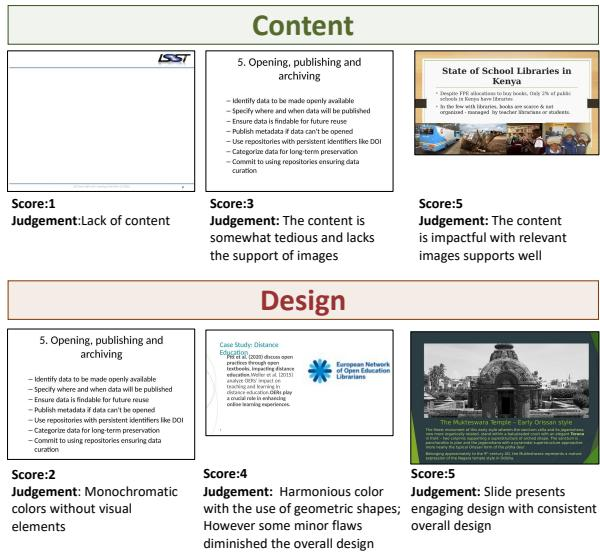  
Figure 8: Scoring Examples of PPTEVAL.

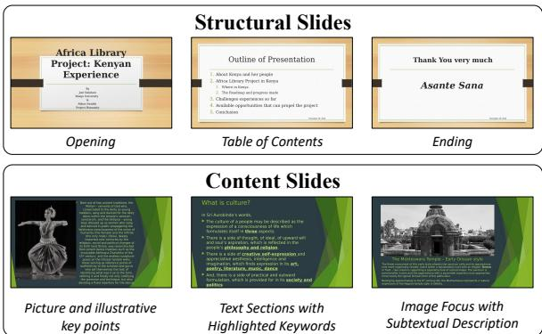  
Figure 9: Example of slide clusters.

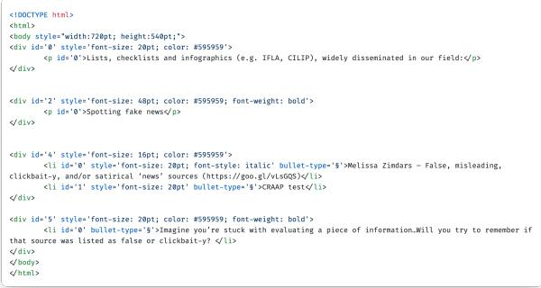  
Figure 10: Example of rendering a slide into HTML format.

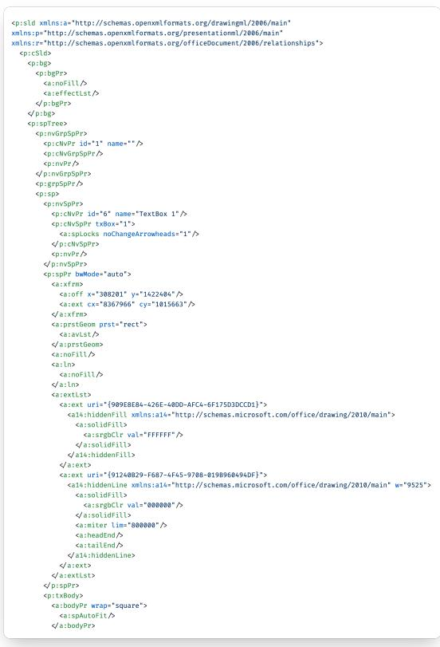  
Figure 11: The first 60 lines of the XML representation of a presentation slide (out of 1,006 lines).

<table><tr><td colspan="2">Configuration</td><td colspan="4">Existing Metrics</td><td colspan="4">PPTEval</td></tr><tr><td>Language ModelVision ModelSR(%)↑</td><td></td><td></td><td>PPL↓</td><td>ROUGE-L↑</td><td>FID↓</td><td>Content↑</td><td>Design↑</td><td>Coherence↑</td><td>Avg.↑</td></tr><tr><td colspan="10">DocPres (rule-based)</td></tr><tr><td>GPT-40Lm</td><td></td><td></td><td>76.42</td><td>13.28</td><td></td><td>2.98</td><td>2.33</td><td>3.24</td><td>2.85</td></tr><tr><td>Qwen2.5LM</td><td></td><td></td><td>100.4</td><td>13.09</td><td></td><td>2.96</td><td>2.37</td><td>3.28</td><td>2.87</td></tr><tr><td colspan="10"> KCTV (template-based)</td></tr><tr><td>GPT-40LM</td><td></td><td>80.0</td><td>68.48</td><td>10.27</td><td></td><td>1.99</td><td>2.35</td><td>2.85</td><td>2.40</td></tr><tr><td>Qwen2.5LM</td><td></td><td>88.0</td><td>41.41</td><td>16.76</td><td></td><td>2.24</td><td>2.59</td><td>2.95</td><td>2.59</td></tr><tr><td colspan="10"> PPTAGENT (ours)</td></tr><tr><td>GPT-40LM</td><td>GPT-40vM</td><td>97.8</td><td>721.54</td><td>10.17</td><td>7.48</td><td>3.17</td><td>3.16</td><td>4.20</td><td>3.54</td></tr><tr><td>Qwen2-VLLM</td><td>Qwen2-VLvM</td><td>43.0</td><td>265.08</td><td>13.03</td><td>7.32</td><td>1.34</td><td>1.43</td><td>1.75</td><td>1.50</td></tr><tr><td>Qwen2.5LM</td><td>Qwen2-VLvM</td><td>95.0</td><td>496.62</td><td>14.25</td><td>6.20</td><td>3.11</td><td>3.10</td><td>4.25</td><td>3.48</td></tr></table>

Table 6: Weighted Performance comparison of presentation generation methods, including DocPres, KCTV, and our proposed PPTAGENT. Results are evaluated using Success Rate (SR), Perplexity (PPL), Rouge-L, Fr’echet Inception Distance (FID), and SR-weighted PPTEval.

# System Message:

You are an expert presentation analyst specializing in categorizing PowerPoint slides, particularly skilled at identifying structural slides (such as Opening, Transitions, and Ending slides) that guide the flow of the presentation. Please follow the specified output format strictly when categorizing the slides.

# Prompt:

Objective: Analyze a set of slides provided in plain text format. Your task is to identify structural slides (such as Opening and Ending) based on their content and categorize all other slides under “Content.”

1. Categorize structural slides in the presentation (such as Opening, Ending); assign all other   
slides to “Content.” 2. Category names for structural slides should be simple, reflect their function, and contain no   
specific entity names. 3. Opening and Ending slides are typically located at the beginning or end of the presentation and   
may consist of only one slide. 4. Other transition categories must contain multiple slides with partially identical text.

Use the Functional key to group all categorized structural slides, with category names that reflect only the slide’s function (e.g., “Opening,” “Ending”) and do not describe any specific content. Use the Content key to list all slides that do not fall into structural categories.

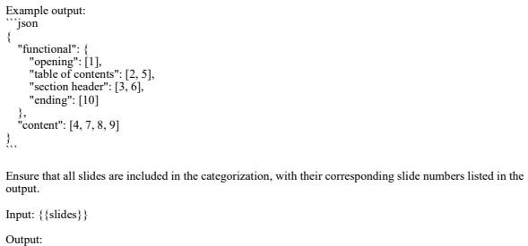  
Figure 12: Illustration of the prompt used for clustering structural slides.

# System Message:

You are a helpful assistant

#

Table 7: Ablation analysis of PPTAGENT utilizing the Qwen $2 . 5 _ { \mathsf { L M } } +$ Qwen2- $\mathrm { . V L } _ { \mathsf { V M } }$ configuration, with PPTEval scores weighted by success rate to demonstrate each component’s contribution.   

<table><tr><td>Setting</td><td>SR(%)</td><td>Content</td><td>Design</td><td>Coherence</td><td>Avg.</td></tr><tr><td>PPTAGENT</td><td>95.0</td><td>3.11</td><td>3.10</td><td>4.25</td><td>3.48</td></tr><tr><td>w/o Outline</td><td>91.0</td><td>2.94</td><td>3.00</td><td>3.05</td><td>3.00</td></tr><tr><td>w/o Schema</td><td>78.8</td><td>2.42</td><td>2.54</td><td>3.18</td><td>2.71</td></tr><tr><td>w/o Structure</td><td>92.2</td><td>3.02</td><td>2.99</td><td>3.18</td><td>3.06</td></tr><tr><td>w/o CodeRender</td><td>74.6</td><td>2.43</td><td>2.49</td><td>3.26</td><td>2.73</td></tr></table>

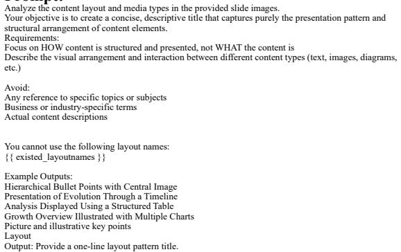  
Figure 13: Illustration of the prompt used to infer layout patterns.

<table><tr><td>Domain</td><td>SR (%) PPL</td><td>FID</td><td>PPTEval</td></tr><tr><td>Culture</td><td>93.0 185.3</td><td>5.00</td><td>3.70</td></tr><tr><td>Education</td><td>94.0 249.0</td><td>7.90</td><td>3.69</td></tr><tr><td>Science</td><td>96.0 500.6</td><td>6.07</td><td>3.56</td></tr><tr><td>Society</td><td>95.0 396.8</td><td>5.32</td><td>3.59</td></tr><tr><td>Tech</td><td>97.0 238.7</td><td>6.72</td><td>3.74</td></tr></table>

Table 8: Evaluation results under the configuration of Qwen2- $\cdot \Delta L _ { L M } + Q w e n 2 - V L _ { V M }$ in different domains, using the success rate (SR), PPL, FID and the average PPTEval score across three evaluation dimensions.

# System Message:

You are a helpful assistant

# Prompt:

Please analyze the slide elements and create a structured template schema in JSON format. The schema should:

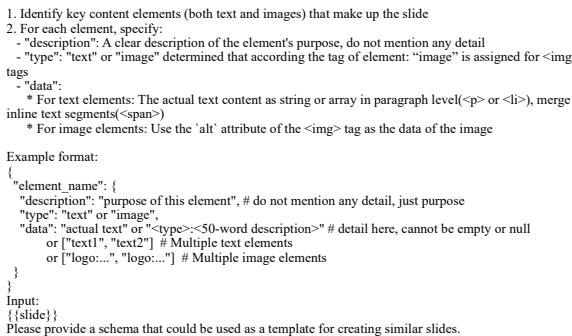  
Figure 14: Illustration of the prompt used to extract the slide schema.

#

You are an Editor agent for presentation content. You transform reference text and available images into structured slide content following schemas. You excel at following schema rules like content length and ensuring all content is strictly derived from provided reference materials. You never generate new content or use images not explicitly provided.

#

Generate slide content based on the provided schema.   
Each schema element specifies its purpose, and its default quantity.   
Requirements: 1. Content Generation Rules: - Follow default_quantity for elements, adjust when necessary - All generated content must be based on reference text or image information - Ensure text content meets character limits - Generated text should use concise and impactful presentation style - For image elements, data should be the image path # eg: "images/logo.png" - Type of images should be a critical factor of image selection, if no relevant image(similar type or   
purpose) provided, leave it blank   
2. Core Elements: - Must extract essential content from reference text (e.g., slide_title, main_content) and maintain   
semantic consistency - Must include images that support the main content (e.g., diagrams for explanations, visuals directly   
discussed in text)

# System Message:

You are a professional presentation designer tasked with creating structured PowerPoint outlines. Each slide outline should include a slide title, a suitable layout from provided options, and concise explanatory notes. Your objective is to ensure that the outline adheres to the specified slide count and uses only the provided layouts. The final deliverable should be formatted as a JSON object. Please ensure that no layouts other than those provided are utilized in the outline.

# Prompt:

1. Understand the JSON Content: Carefully analyze the provided JSON input. Identify key sections and subsections.

{{ json_content }}

2. Generate the Outline: Ensure that the number of slides matches the specified requirement.   
Keep the flow between slides logical and ensure that the sequence of slides enhances understanding. Make sure that the transitions between sections are smooth through functional layouts. Carefully analyze the content and media types specified in the provided layouts. For each slide, provide:   
A Slide Title that clearly represents the content.   
A Layout selected from provided layouts tailored to the slide’s function.   
Slide Description, which should contain concise and clear descriptions of the key points.

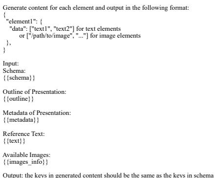  
Figure 16: Illustration of the prompt used for generating slide content.

Please provide your output in JSON format.

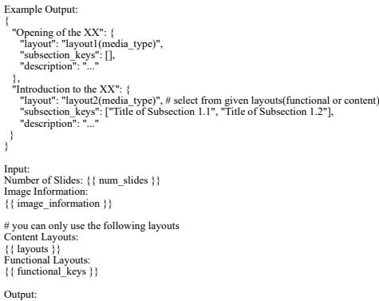  
Figure 15: Illustration of the prompt used for generating the outline.   
Figure 17: Illustration of the prompt used for generating editing actions.

# System Message:

You are a Code Generator agent specializing in slide content manipulation. You precisely translate content edit commands into API calls by following HTML structure, distinguishing between tags, and maintaining proper parent-child relationships to ensure accurate element targeting.

# Prompt:

Generate the sequence of API calls based on the provided commands, ensuring compliance with the specified rules and precise execution. You must determine the parent-child relationships of elements based on indentation and ensure that all  and  elements are processed, leaving no unhandled content.

Each command follows this format: (element_class, type, quantity_change: int, old_data, new_data).

#

1. Quantity Adjustment: - quantity_change Rules: - If quantity_chang ${ \bf \Pi } = 0 ,$ do not perform clone_paragraph or del_span operations. Only replace the   
content. - If quantity_change $> 0 ,$ , use clone_paragraph to add the corresponding number of paragraphs: - When cloning, prioritize paragraphs from the same element_class that already have special styles   
(e.g., bold, color) if available. - The paragraph_id for newly cloned paragraphs should be the current maximum paragraph_id of the   
parent element plus 1, while retaining the span_id within the cloned paragraph unchanged. - If quantity_change $< 0 ,$ use del_span or del_image to reduce the corresponding number of elements.   
Always ensure to remove span elements from the end of the paragraph first. Restriction: - Each command’s API call can only use either clone_paragraph or del_span/del_image according to   
the \`quantity_change\`, but not both. 2. Content Replacement: - Text Content: Use replace_span to sequentially distribute new content into one or more    
elements within a paragraph. Select appropriate tags for emphasized content (e.g., bold, special color, larger   
font). - Image Content: Use replace_image to replace image resources. 3. Output Format: - Add comments to each API call group, explaining the intent of the original command and the   
associated element_class. - For cloning operations, annotate the paragraph_id of the newly created paragraphs. Available APIs {{api_docs}} Example Input: Please output only the API call sequence, one call per line, wrapped in \`\`\`python and \`\`\`, with comments

for corresponding commands.

# System Message:

You are a help assistant

# Prompt:

Please describe the input slide based on the following three dimensions:   
1. The amount of information conveyed Whether the slide conveys too lengthy or too little information, resulting in a large white space without colors or images.   
2. Content Clarity and Language Quality Check if there are any grammatical errors or unclear expressions of textual content.   
3. Images and Relevance Assess the use of visual aids such as images or icons, their presence, and how well they relate to the theme and content of the slides.

Provide an objective and concise description without comments, focusing exclusively on the dimensions outlined above.

Figure 18: Illustration of the prompt used to describe content in PPTEval.

# System Message:

You are a help assistant

# Prompt:

Please describe the input slide based on the following three dimensions:   
1. Visual Consistency Describe whether any style diminished the readability, like border overflow or blur, low contrast, or visual noise.   
2. Color Scheme Analyze the use of colors in the slide, identifying the colors used and determining whether the design is monochromatic (black and white) or colorful (gray counts in).   
3. Use of Visual Elements Describe whether the slide include supporting visual elements, such as icons, backgrounds, images, or geometric shapes (rectangles, circles, etc.).

Provide an objective and concise description without comments, focusing exclusively on the dimensions outlined above.

# Figure 19: Illustration of the prompt used to describe style in PPTEval.

# System Message:

You are an expert presentation content extractor responsible for analyzing and summarizing key elements and metadata of presentations. Your task is to extract and provide the following information:

#

Scoring Criteria (Five-point scale):

1. Slide Descriptions: Provide a concise summary of the content and key points covered on each slide. 2. Presentation Metadata: Identify explicit background information(which means it should be a single paragraph, not including in other paragraphs), such as the author, speaker, date, and other directly stated details, from the opening and closing slides.

Example Output: "slide_1": "This slide introduces the xx, xx.", "slide_2": "...", "background": { "speaker": "speaker x", "date": "date x" }   
}   
Input:   
{{presentation}}   
Output:.

Figure 20: Illustration of the prompt used to extract content in PPTEval.

# System Message:

You are an unbiased presentation analysis judge responsible for evaluating the quality of slide content. Please carefully review the provided slide image, assessing its content, and provide your judgement in a JSON object containing the reason and score. Each score level requires that all evaluation criteria meet the standards of that level.

#

Scoring Criteria (Five-Point Scale):

1 Point (Poor):   
The text on the slides contains significant grammatical errors or is poorly structured, making it difficult to understand. 2 Points (Below Average):   
The slides lack a clear focus, the text is awkwardly phrased, and the overall organization is weak, making it hard to engage the audience.

3 Points (Average):

The slide content is clear and complete but lacks visual aids, resulting in insufficient overall appeal.

5 Points (Excellent):

The slides are well-developed with a clear focus, and the images and text effectively complement each other to convey the information successfully.

The slide content is clear and well-developed, but the images have weak relevance to the theme, limiting the effectiveness of the presentation.

Example Output:   
{   
"reason": "xx",   
"score": int   
}   
Input: {{descr}}   
Let's think step by step and provide your judgment.

You are an unbiased presentation analysis judge responsible for evaluating the visual appeal of slides. Please carefully review the provided description of the slide, assessing their aesthetics only, and provide your judgment in a JSON object containing the reason and score. Each score level requires that all evaluation criteria meet the standards of that level.

# Prompt:

Scoring Criteria (Five-point scale):

# System Message:

1 Point (Poor): There is a confl

ict between slide styles, making the content difficult to read.

2 Points (Fair):

The slide uses monotonous colors(black and white), ensuring readability while lacking visual appeal.

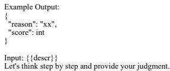  
Figure 21: Illustration of the prompt used to evaluate content in PPTEval.

3 Points (Average): The slide employs a basic color scheme; however, it lacks supplementary visual elements such as icons, backgrounds, images, or geometric shapes(like rectangles), making it look plain.

# 4 Points (Good):

The slide uses a harmonious color scheme and contains some visual elements(like icons, backgrounds, images, or geometric shapes); however, minor flaws may exist in the overall design.

# 5 Points (Excellent):

The style of the slide is harmonious and engaging, the use of supplementary visual elements like images and geometric shapes enhances the slide’s overall visual appeal.

Figure 22: Illustration of the prompt used to evaluate style in PPTEval.

# System Message:

You are an unbiased presentation analysis judge responsible for evaluating the coherence of the presentation. Please carefully review the provided summary of the presentation, assessing its logical flow and contextual information, each score level requires that all evaluation criteria meet the standards of that level.

# Prompt:

Scoring Criteria (Five-Point Scale)

1 Point (Poor):   
Terminology are inconsistent, or the logical structure is unclear, making it difficult for the audience to understand. 2 Points (Fair):   
Terminology are consistent and the logical structure is generally reasonable, with minor issues in transitions.

3 Points (Average):

The logical structure is sound with fluent transitions; however, it lacks basic background information.

4 Points (Good):

The logical flow is reasonable and include basic background information (e.g., speaker or acknowledgments/conclusion).

5 Points (Excellent):

The narrative structure is engaging and meticulously organized with detailed and comprehensive background information included.

Example Output:   
{   
"reason": "xx",   
"score": int   
}   
Input:   
{{presentation}}

Let's think step by step and provide your judgment, focusing exclusively on the dimensions outlined above and strictly follow the criteria.

Figure 23: Illustration of the prompt used to evaluate coherence in PPTEval.