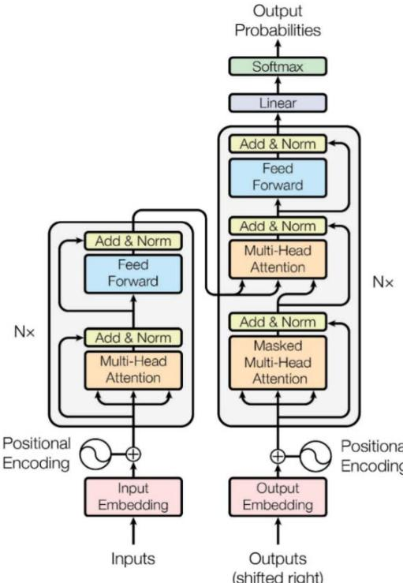
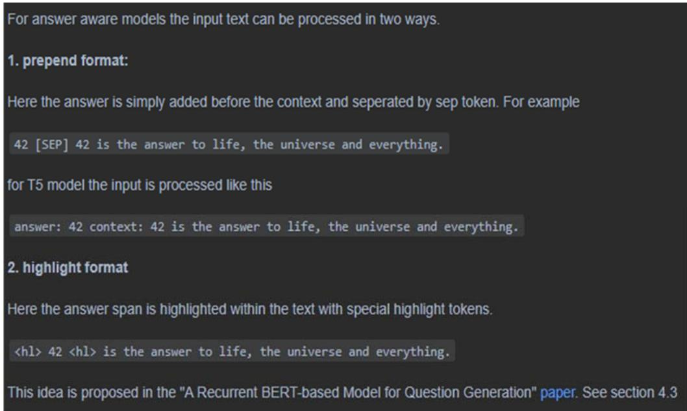
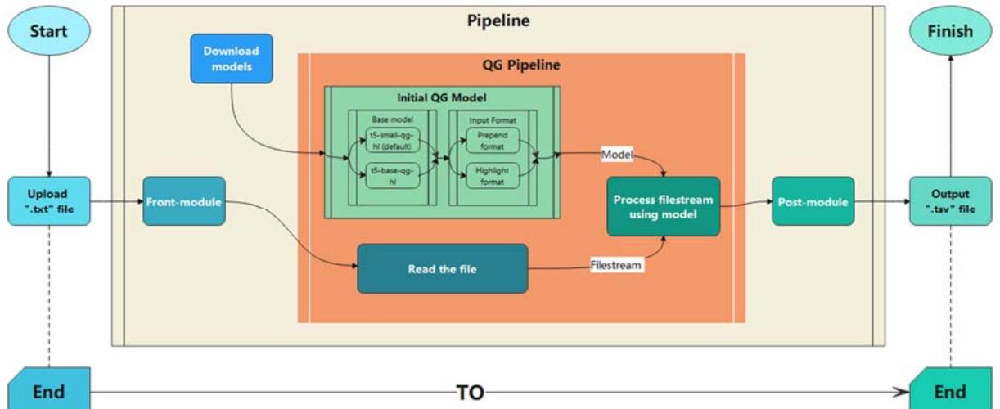

# Automatic Generation System of Frequently Asked Questions Based on the T5 Model

Zheyu Chen1, a

1 Software Engineering, University College Dublin, Dublin, 999014, Ireland a Corresponding Author’s Email: czy5722025@163.com

Abstract: Question generation is a widely used technique in natural language processing, and it can be applied in many contexts. In order to provide domain-specific FAQs efficiently and comprehensively, this work designs an automated system for Frequently Asked Questions (FAQ) generation based on the T5 model. This work makes some optimizations and adjustments based on an open-source project with high review scores, mainly in terms of performance and data format, in order to be able to obtain a more comprehensive output with more direct input, which ultimately meets the expectations. This work also designed a Django-based web page as an initial user interface. This work is a practical application project for question generation with some practicality and can be used to build or extend a domain-specific FAQ knowledge database.

Keywords: Question generation, Transformer, T5, Frequently Asked Questions.

# 1. Introduction

# 1.1. Background

Question Generation (QG) is an essential subtask in text generation, aiming to generate input-relevant and naturally flowing questions based on input data (text, knowledge base, images, and other types). Due to the successful development of Machine Reading Comprehension (MRC) and intelligent question-answer systems, question generation is receiving more and more attention.[1] The models in this project mainly use Transformer and T5, both cutting-edge natural language processing models from Google. Transformer [2] (figure 1) originated from a paper, "Attention Is All You Need" published by Google in 2017, which has achieved excellent results on several natural language processing tasks. On October 23, 2019, Google published another paper, "Exploring the Limits of Transfer Learning with a Unified Text-to-Text Transformer", the T5 (Transfer Text-to-Text Transformer) model in that paper provides a grand unification of NLP tasks, transforming all NLP tasks into Text-to-Text tasks.

  
Figure 1. The Transformer - model architecture

# 1.2. Research Status

The development of applications and technologies in question generation has been going on for decades of development and iteration. Question generation is a sub-task of the NLP domain on the technical side. The implementation varies between languages. For example, the Chinese question generation task [3] is highly challenging. Pre-trained models are helpful tools for question generation, such as BERT and T5 language models or GPT-3 language generation models, producing quite fluent natural language. [4] In terms of applications, QG has been used extensively for question paper question generation, including helping teachers to automatically generate short answer questions; [4] Multiplechoice Cloze-test Question generation based on learning content in a particular language. [5] Some studies automatically generate datasets of relevant questions through children's stories [3].

FAQ systems as a practical question and answer system [6], the optimization of FAQ generation and retrieval is an effective means to improve the performance of such question and answer systems. For example, some studies have introduced a new Kmeans-based clustering method for optimizing FAQ search [7]. An online FAQ system is also based on a wiki engine [8]. These case studies show that there are various ways to optimize the search of the FAQ system.

# 1.3. Significance of the Subject

The FAQ is a vital part of the introduction section of a website or project. This section is significant and indispensable to improving the user's understanding of the site and improving user ease of use. In addition, FAQ-based question and answer systems are easy to build and effective question and answer systems that can also be used as part of a complex question and answer system. [6] Unfortunately, researchers have demonstrated that humans are not good at asking questions [9]. Creating a question and answer database requires staff to gather relevant information on the Web and generate questions manually for this enormous amount of information, which is a time-consuming and error-prone task. Just as many studies on FAQ system retrieval propose optimized ways to improve the user experience, an easy-touse FAQ generation system for staff members is an effective tool to improve efficiency. Therefore, automatic question generation is necessary to generate good questions and improve staff efficiency. This work built an automatic FAQ generation system using a QG model based on T5, which can create many frequently asked questions and answers that can be used to generate the FAQ database needed by staff or expand the existing FAQ database.

# 1.4. Raise Questions

For this study, there are two primary questions to address:

How to use the original project as a basis for improvement to achieve the purpose of this work?

How to make the system easy to use?

# 2. Materials & Methods

# 2.1. Preparation and Preprocessing

The data I used were mainly from COVID-19 related manuals and materials, including profiles of people related to COVID-19 on Wikipedia and timeline information on related events. This work filtered and organized these collected data and divided them into five categories as the base experimental data: prevention and control, health and medicine, event and timeline, character, and epidemic. Regarding acquiring the base model, this work compared and filtered the question generation models in GitHub open-source projects and finally selected a QG project based on the T5 model, which achieved high scores on automatic evaluation metrics such as BLEU and ROUGE scores. This work cleaned up the collected text files during the data processing, including removing special symbols and unique characters and meaningless blank lines.

# 2.2. Project Introduction and Evaluation

The project I chose for this project is an open-source study in which three tasks are accomplished, of which the first type of task, question generation, fits this study's project perfectly. The project uses a pre-trained transformer (specifically the seq-2-seq model) and a straightforward end-to-end approach without too many complex pipelines [10]. End-to-end means that by scaling down manual preprocessing and subsequent processing, the model is taken from the original input to the final output as much as possible, giving the model more room to automatically adjust to the data and increasing the overall fit of the model. Input formats in this project can be handled in two ways, namely "prepend format" and "highlight format" (figure 2). The default model is "valhalla/t5-small-qg-hl", but it can be modified by passing model parameters. The model score is detailed here. (table 1).

  
Figure 2. Different formats

Table 1. Models' scores   

<table><tr><td>Name</td><td>BLEU-4</td><td>METEOR</td><td>ROUGE-L</td><td>QG-FORMAT</td></tr><tr><td>t5-base-qg-hl</td><td>21.3226</td><td>27.0854</td><td>43.5962</td><td>highlight</td></tr><tr><td>t5-small-qg-hl</td><td>18.5921</td><td>24.9915</td><td>40.1886</td><td>highlight</td></tr><tr><td>t5-small-qg-prepend</td><td>18.2791</td><td>24.6722</td><td>39.958</td><td>prepend</td></tr></table>

# 2.3. Experimental Improvement Process

To address the first issue I raised in the previous section. This work did the following: firstly, I dissected the source code of the project and optimized the IO part of the project; next, this work added a front module and a post-module to the project, and finally, this work bridged the new module with the original module.

For the IO part of the project, since the original model task was to generate questions for a small segment of known length, the text size was not considered. This work modifies the text reading method from string reading to file reading line by line. Additionally, increasing the number of extracts for entity recognition, seeking a more significant individual text length within a reasonable performance requirement, and reducing the impact of accuracy caused by sliced text. The front module implements automatic source text slicing and naming standardization and iterates through all files with custom standardized naming and docks to use the pipeline processing of the original module. In addition, the pre-module also includes a data cleaning function to remove special symbols, unique characters, and meaningless blank lines, which ensures the reliability of the input data and improves the fault tolerance and stability of the system. The postmodule implements the automatic storage of the generated data as ‘.tsv' file format files. The input and output files correspond, maintaining the end-to-end feature. (figure 3)

  
Figure 3. Project flow chart (Maintain end-to-end features)

The second issue is explained as follows: First, this work integrated the operation of automatic file splitting into the project so that the user only needs to input a single file, which lowers the operation threshold. Users do not need to worry about data file compliance because the input files are automatically cleaned and split in the front module. Secondly, proper file naming is an essential means of preserving the information. The user will get the output file in tsv format corresponding to its input file, containing all the question and answer pairs extracted from the input file. Finally, this work has also provided a user interface for the project to facilitate the user's use, which will be described in detail in the next section.

# 3. Result & Discussion:

# 3.1. Website Function Introduction

As mentioned many times before, this work aims to make the model applicable to the production environment and obtain comprehensive and complete output under appropriate performance requirements and time consumption. Therefore, this work optimized and adjusted the project's input, processing, and output—moreover, this work designed and implemented a web page based on python and Django frameworks. The website only requires the user to upload a txt file, and after a while, a partial preview is displayed on the web page, while the user can also download and get the full version of the generated Q&A pairs text file in tsv format. At the same time, the site can also read the TSV file directly and preview it partially in real-time, which vastly reduces the user's threshold and difficulty of use and can be deployed once and used many times. However, due to the cost of computing platforms and performance issues, there is no cloud platform service. However, all the code can be obtained on GitHub and deployed.

# 3.2. Evaluation

This research provides a practical application of question generation tasks in NLP, providing a viable idea for the construction and supplementation of an FAQ library. It is research with practical significance. The core idea of this research is to design and implement a usable system that is also cutting-edge in its choice of technology to ensure that the results are cutting-edge for the current period.

# 3.3. Limitations Description and Solution Outlook

This study also has limitations: firstly, the model selection is not flexible enough. Although T5 is a recognized excellent model, there are still some excellent models, such as BERT,

BART, or other valid variants. Future work can adjust the model input parameters during the model initialization process, adjust part of the project code as required, and finally achieve the ability to add any model. Different results are generated for different model selections; users have more flexibility to choose the results they prefer.

Secondly, the design of this work's website is slightly rough, and it cannot be deployed on the cloud server due to the cost and performance of the computing platform. Therefore, this work cannot provide online services. The website's construction for future work is pivotal in improving the user experience. At the same time, the staff building their website based on the project's work is also a good choice, which leaves the possibility of user customization.

# 4. Conclusion

This research explores the application of question generation in the FAQ field, designs and implements a usable automatic FAQ generation system, and provides a web demo and available open-source systems for interested customers. Also, this research provides a feasible idea for the construction and supplementation of FAQ libraries using a cutting-edge model and is a study of practical importance. The experimentation and exploration of this study provide a usable design idea and model for subsequent research in this direction, which is helpful for the subsequent work. The lack of flexibility in model selection and the rudimentary user interface design are areas for improvement. However, in these two aspects, the subsequent research can be improved by adjusting the code to add models, web page construction, and user customization to complete the improvement. In the future, if the application requirements of this system are large enough, website building and online services are excellent solutions for providing the service. More models will be added to the project, and the user's threshold of access can be minimized are the future direction of this research. The application of QG in the FAQ filed will be a valuable service to explore and try out.

# References

[1] Chan, Y., Fan, Y., (2019) A Recurrent BERT-based Model for Question Generation. Proceedings of the 2nd Workshop on Machine Reading for Question Answering, 154--162   
[2] Vaswani, A., Noam, S., (2017) Attention Is All You Need. Advances in Neural Information Processing Systems, 30   
[3] Lee, C. H., Chen, T. Y., Chen, L. P., Yang, P. C., Tsai, R. T. H., (2018), Automatic Question Generation from Children’s Stories for Companion Chatbot. In: 2018 IEEE International Conference on Information Reuse and Integration (IRI), 491- 494   
[4] D. C. L. Tsai, A. Y. Q. Huang, O. H. T. Lu and S. J. H. Yang, (2021), Automatic Question Generation for Repeated Testing to Improve Student Learning Outcome. In: 2021 International Conference on Advanced Learning Technologies (ICALT), 339-341   
[5] Qiu, X., Xue, H., Liang, L., Xie, Z., Liao, S., Shi, G., (2021) Automatic Generation of Multiple-choice Cloze-test Questions for Lao Language Learning. 125-130   
[6] Mao, J.Zhu, J., (2012) FAQ Auto Constructing Based on Clustering. In: 2012 International Conference on Computer Science and Electronics Engineering, 1:468-472   
[7] Pourreza-Shahri, M., Kahani, M., Ekbia, H., (2016) Providing FAQ lists based on ontology. In: 2016 24th Iranian Conference on Electrical Engineering (ICEE), 305-310   
[8] Jinwei, F.Jianhong, S.Tianqing, X., (2010) A FAQ online system based on wiki. In: 2010 International Conference on EHealth Networking Digital Ecosystems and Technologies (EDT), 1:66-68   
[9] Pabitha, P., Mohana, M., Suganthi, S., Sivanandhini, B., (2014) Automatic Question Generation system. In: 2014 International Conference on Recent Trends in Information Technology, 1-5   
[10] Lopez, L. E., Cruz, D. K., Cruz, J. C. B., & Cheng, C. (2020). Transformer-based end-to-end question generation. arXiv preprint arXiv:2005.01107, 4.

# Appendix

Origin project URL: https://github.com/patilsuraj/question_generation This work project URL: https://github.com/DIKLA2322/QG_demo